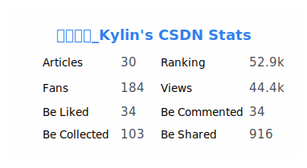

# data-card
一个展示网站数据的卡片

- [x] 掘金
- [x] CSDN
- [ ] LeetCode
- [ ] 语雀

## 使用方法

### yml配置

| 参数           | 说明               | 类型   | 可选值 | 默认值                    |
| -------------- | ------------------ | ------ | ------ | ------------------------- |
| github_token   | GitHub token`必须` | string | --     | --                        |  |
| jue_jin_id     | 掘金ID`必须`       | string | --     | --                        |  |
| csdn_name      | CSDN用户名`必须`   | string | --     | --                        |
| commit_message | commit信息         | string | --     | feat: Add Card Image [ci] |  |
| branch         | 推送分支           | string | --     | main                      |  |

### yml Demo
```yml
name: generate-data-card

on:
  schedule:
    - cron: '0 0 * * *'
  workflow_dispatch:

jobs:
  generate-card:
    runs-on: ubuntu-latest
    steps:
      - name: Use Data Card Action
        uses: lxKylin/data-card@action
        with:
          github_token: ${{ secrets.DATA_CARD_TOKEN }} # Github token
          JueJinId: ${{ secrets.JUEJIN_PARAMS }} # 掘金用户id
          commit_message: 'JueJin Card', # 提交信息，默认：feat: Add Card Image [ci]
          branch: main # 提交分支，默认：main

```

## 掘金

- 使用掘金主页`url`后的一串数字作为`JueJinId`，例如`https://juejin.cn/user/1667667673461376`对应`1667667673461376`


- 掘金卡片如下：


## CSDN

- 使用`CSDN`个人主页`url`后的字符串作为`csdnName`，例如`https://blog.csdn.net/qq_40592625`对应`qq_40592625`


- CSDN卡片如下：


